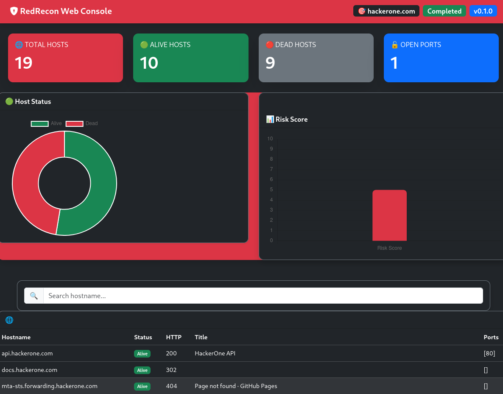
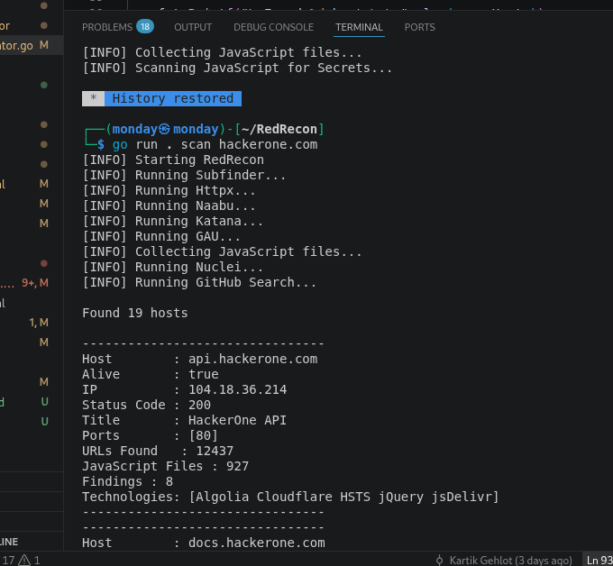
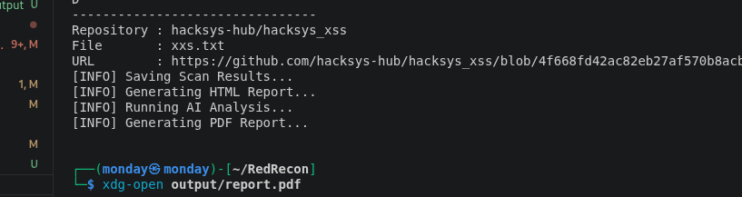
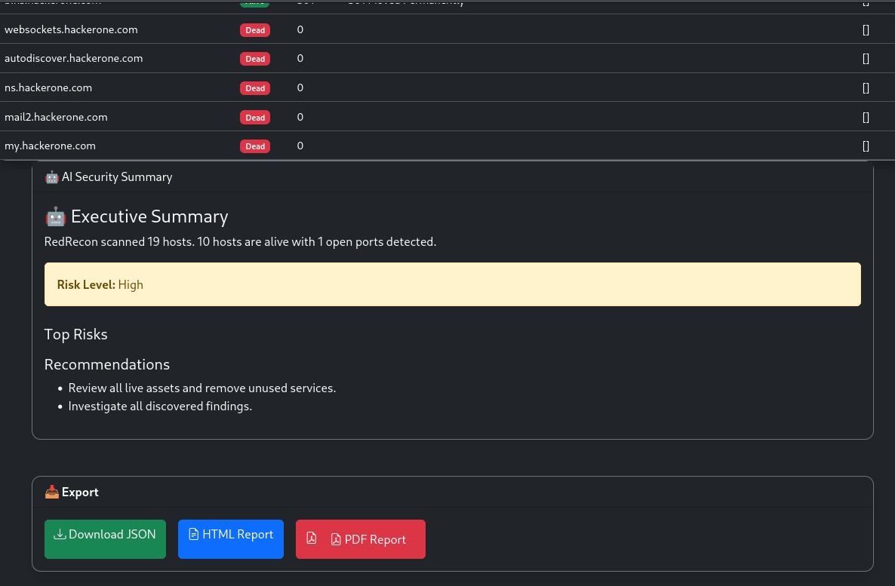
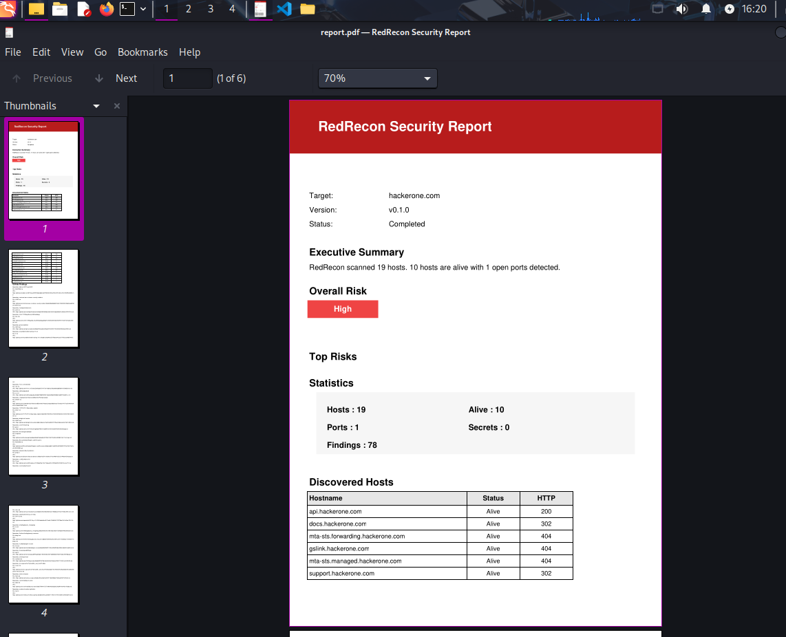
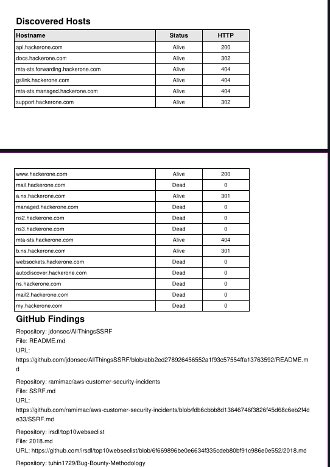

🚀 RedRecon

RedRecon is a reconnaissance framework written in Go that I built to automate the early stages of security assessments. Instead of running multiple tools individually and manually collecting their output, RedRecon brings everything together into a single workflow and generates organized reports.

The project started as a way to learn Go while building something practical for penetration testing and bug bounty hunting. Along the way, I added features like an interactive dashboard, AI-generated security summaries, and PDF report generation to make the output easier to understand.
Building RedRecon helped me understand how to organize larger Go projects into reusable packages, work with JSON data, generate reports, design dashboards, and integrate multiple security tools into a single workflow. It also improved my understanding of project architecture and writing maintainable Go code.


## Dashboard



---

 Features

* Subdomain enumeration
* JavaScript collection
* Secret detection
* Nuclei integration
* GitHub reconnaissance
* Interactive web dashboard
* HTML report generation
* PDF report generation
* AI-generated executive summary
* JSON export

             User
               │
               ▼
          Cobra CLI
               │
               ▼
        Orchestrator
               │
 ┌─────────────┼─────────────┐
 ▼             ▼             ▼
Scanners     AI Engine    Reports
               │             │
               ▼             ▼
          Dashboard      HTML/PDF


---

 Why I Built This

During reconnaissance, I often found myself switching between multiple tools and manually reviewing different outputs. I wanted a single application that could automate those steps and present the results in a cleaner format.

RedRecon was built to solve that problem while also helping me improve my Go programming skills by working on a real project instead of small practice programs.


---

 Project Structure


RedRecon/
├── cmd/
├── internal/
│   ├── ai/
│   ├── dashboard/
│   ├── models/
│   ├── orchestrator/
│   ├── output/
│   ├── pdf/
│   ├── report/
│   ├── scanners/
│   └── validator/
├── templates/
├── output/
├── screenshots/
├── main.go
├── go.mod
└── README.md

## Integrated Tools

- Subfinder
- Httpx
- Naabu
- Katana
- GAU
- Nuclei


---

 Installation

Clone the repository:

```bash
git clone https://github.com/kartik-Gehlot/RedRecon.git
cd RedRecon
```

Install dependencies:

```bash
go mod tidy
```

---

 Usage

Start a scan:

```bash
go run . scan hackerone.com
```

Launch the dashboard:

```bash
go run . dashboard
```

---

 Reports

After a scan completes, RedRecon generates:

* `scan.json` – Raw scan results
* `report.html` – HTML report
* `report.pdf` – PDF report

These files are saved in the `output/` directory.
## Terminal




---

 Dashboard

The dashboard provides a quick overview of the scan, including:

* Scan statistics
* Host information
* AI-generated summary
* Risk level
* Recommendations
* Export options



---

 PDF Report

The generated PDF includes:

* Executive summary
* Risk assessment
* Statistics
* Discovered hosts
* GitHub findings
* Security recommendations

## PDF Report




---

 ## Future Improvements

There are still several ideas I'd like to add in future versions:

* Plugin support
* Concurrent scanning pipeline
* Scan history
* REST API
* Docker support
* Authentication
* Database integration
* Live scan progress

---

 Tech Stack

* Go
* Cobra CLI
* Bootstrap 5
* Chart.js
* gofpdf

---

 Author

Kartik Gehlot

I'm interested in offensive security, red teaming, and building practical cybersecurity tools. RedRecon is one of my learning projects where I combined Go development with security automation.

If you have suggestions or feedback, feel free to open an issue or contribute to the project.

## Disclaimer

RedRecon is intended for authorized security testing, research, and educational purposes only. Always obtain permission before scanning systems you do not own or manage.
